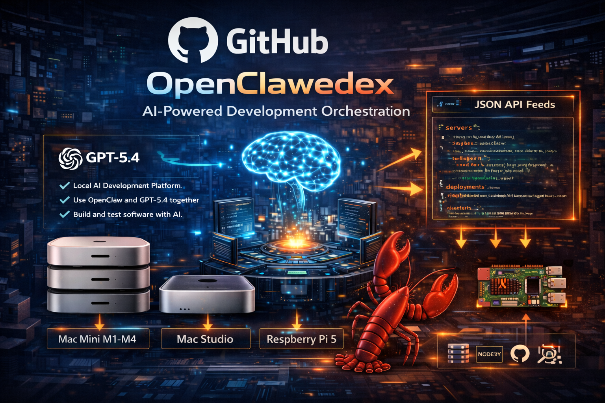

# OpenClawedex

<p align="center">
  
</p>

<p align="center">
  
  
  
  
  
  
</p>

OpenClawedex is standalone tooling for Matthew X. Murphy's OpenClaw gateway workflow.

It exists for one specific operational problem:

- Codex authentication often happens on one machine
- OpenClaw runs as a different service user
- model routing lives in `~/.openclaw/openclaw.json`
- provider credentials live in `~/.openclaw/agents/<agentId>/agent/auth-profiles.json`
- the real pain is in the gaps between those files

This repo turns that into a repeatable project instead of a pile of one-off fixes.

In one line: OpenClawedex helps you inspect, sync, and switch an OpenClaw gateway onto Codex OAuth and `openai-codex/gpt-5.4` without editing live state blind.

## Scope

OpenClawedex is for:

- inspecting OpenClaw state for Codex readiness
- syncing Codex auth into the target runtime user
- updating OpenClaw defaults to `openai-codex/gpt-5.4`
- leaving timestamped backups before config edits
- producing a human-readable doctor report with next steps
- checking macOS-backed feature readiness only when those features are enabled

OpenClawedex is not for:

- publishing OpenClaw skills
- replacing the OpenClaw onboarding wizard
- pretending OAuth is already imported when it is not
- provisioning the full host from scratch

## Project layout

```text
bin/
  openclawedex.js         Thin executable wrapper
src/
  cli.js                  Argument handling and command dispatch
  constants.js            Shared defaults and strings
  paths.js                Filesystem path resolution
  formatting.js           Human and JSON output helpers
  commands/
    inspect.js            State inspection command
    configure.js          Config mutation command
    doctor.js             Higher-level readiness report
  lib/
    files.js              JSON/file/backup helpers
    state.js              OpenClaw/Codex plus optional bridge inspection
    mutation.js           Config rewrite logic
docs/
  architecture.md         Why the project exists
  gateway-playbook.md     Real-world usage flow
  provider-policy.md      Recommended provider and agent routing
  design-notes.md         Design decisions and boundaries
examples/
  openclaw.json.example   Example target config shape
test/
  cli.test.js             CLI parsing and formatting checks
  state.test.js           Optional bridge readiness checks
  mutation.test.js        Config rewrite behavior
```

## Commands

### `inspect`

Inspect an OpenClaw state directory and report:

- whether Codex auth exists
- whether OpenClaw config exists
- whether `auth-profiles.json` already contains `openai-codex`
- what the current default model is
- whether the requested agent has its own model override

Example:

```bash
openclawedex inspect \
  --openclaw-home /home/openclaw/.openclaw \
  --codex-auth /home/openclaw/.codex/auth.json
```

JSON output:

```bash
openclawedex inspect --json
```

### `configure`

Update OpenClaw to use Codex as the primary model path.

By default this command:

- syncs the chosen `auth.json` into the target `~/.codex/auth.json`
- imports a matching `openai-codex` OAuth profile into `auth-profiles.json` when usable Codex tokens are present
- updates `agents.defaults.model.primary`
- adds `agents.defaults.models["openai-codex/gpt-5.4"].params.transport = "auto"`
- updates the selected agent override if that agent exists
- writes a timestamped backup next to `openclaw.json`

Example:

```bash
openclawedex configure \
  --openclaw-home /home/openclaw/.openclaw \
  --codex-auth /home/openclaw/.codex/auth.json
```

Dry run:

```bash
openclawedex configure --dry-run
```

### `doctor`

Produce a more explicit operational report than `inspect`.

It answers:

- what is missing
- what is already correct
- what still needs a real OpenClaw OAuth import
- whether the current config already points at Codex
- whether enabled macOS-backed features already resolve locally or through wrappers

Example:

```bash
openclawedex doctor --openclaw-home /home/openclaw/.openclaw
```

## Typical gateway flow

1. Copy or create Codex auth for the target runtime user.
2. Run `openclawedex inspect`.
3. Run `openclawedex configure`.
4. Re-run `openclawedex doctor`.

If the doctor still reports a missing `openai-codex` runtime profile, the local
`auth.json` did not contain usable OAuth tokens and you still need the native
OpenClaw login flow:

```bash
openclaw models auth login --provider openai-codex
```

## Provider policy

OpenClawedex works best when one provider is not doing every job:

- `main` stays on `openai-codex/gpt-5.4`
- heartbeat and recurring health jobs stay on local Ollama
- named worker lanes can use lower-cost cloud providers
- optional burst providers such as xAI or Big Pickle stay off the critical path

The current recommended routing policy is documented in
[docs/provider-policy.md](docs/provider-policy.md).

## Optional macOS bridge support

OpenClawedex now treats the Mac bridge as optional capability, not a hard dependency.

The rule is:

- if a Mac-backed feature is disabled in `openclaw.json`, OpenClawedex skips it
- if the feature is enabled and the binary already exists locally on Linux, OpenClawedex counts that as supported
- if the feature is enabled and the binary is missing, OpenClawedex tells you to install `macos-bridge`

Supported feature-to-tool checks:

- `channels.imessage` -> `imsg`
- `channels.reminders` -> `remindctl`
- `channels.notes` -> `memo`
- `channels.things` -> `things`
- `channels.peekaboo` -> `peekaboo`

Example feature config:

```json
{
  "channels": {
    "imessage": {
      "enabled": true,
      "remoteHost": "agent2@192.168.88.12"
    },
    "notes": {
      "enabled": true,
      "remoteHost": "agent2@192.168.88.12"
    },
    "reminders": {
      "enabled": false
    }
  }
}
```

If one of those features is enabled and you want the Mac-owned implementation on a Linux gateway:

```bash
clawhub install macos-bridge
```

Then install wrappers from the skill folder. With `channels.*.enabled` and `remoteHost` already present in `openclaw.json`, the pack installer now auto-selects only the enabled tools:

```bash
cd ~/.openclaw/skills/macos-bridge
scripts/install-macos-pack.sh \
  --target-dir /usr/local/bin \
  --openclaw-config /home/openclaw/.openclaw/openclaw.json \
  --default-host agent2@192.168.88.12 \
  --ssh-key /home/openclaw/.openclaw/keys/macos-bridge_ed25519 \
  --known-hosts /home/openclaw/.ssh/known_hosts
```

Verification:

```bash
scripts/verify-macos-pack.sh \
  --target-dir /usr/local/bin \
  --openclaw-config /home/openclaw/.openclaw/openclaw.json
```

That keeps the workflow honest:

- disabled features do not create fake failures
- local Linux installs still count as support
- only enabled Mac-backed features need the bridge skill

## Important limitation

This project can sync `~/.codex/auth.json`, import an `openai-codex` OAuth
profile from usable Codex tokens, and set the model defaults. It still does not
manufacture missing OAuth tokens out of thin air.

If the source `auth.json` lacks usable `access_token` / `refresh_token` values,
OpenClawedex will tell you that directly and you still need the native OpenClaw
OAuth login flow.

## Development

Install locally:

```bash
npm link
```

Run tests:

```bash
npm test
```

Run directly:

```bash
node ./bin/openclawedex.js inspect
```

Show the release version:

```bash
openclawedex --version
```
